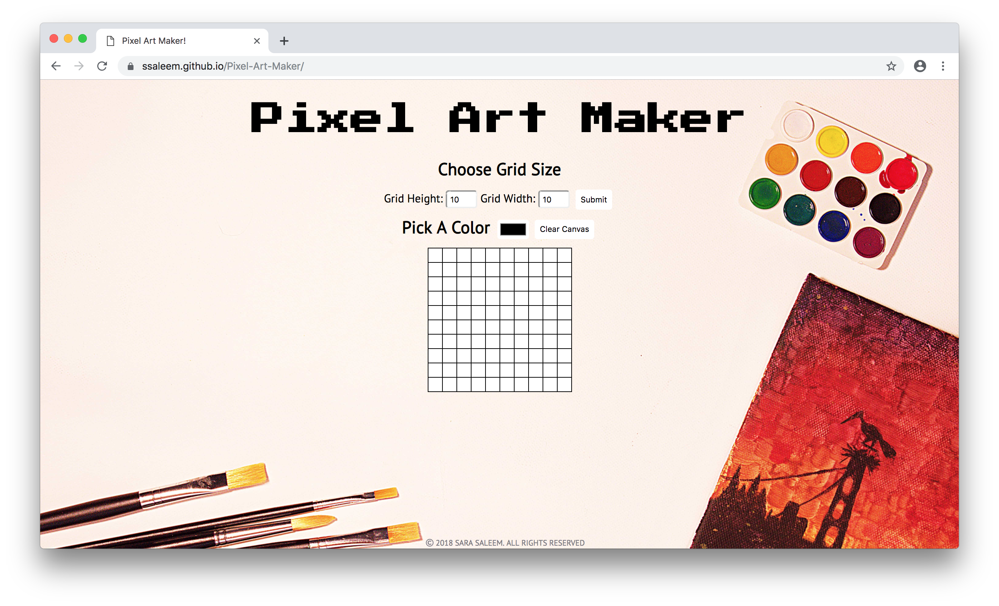

# Pixel Art Maker Project

This project uses HTML `<table>` to create a grid and jQuery for event handling. Background image for the app is from [Pexels](https://www.pexels.com/).

## Built with
- [jQuery](https://jquery.com/) - a JavaScript library designed to simplify the client-side scripting.
- [HTML Table](https://www.w3schools.com/html/html_tables.asp)
- [HTML Form](https://www.w3schools.com/html/html_forms.asp)
- [gulp](https://www.npmjs.com/package/gulp) plugins - gulp-imagemin, gulp-autoprefixer, browserSync.

## Live Version
Project demo can be found [here](https://ssaleem.github.io/PixelArtMaker/)
